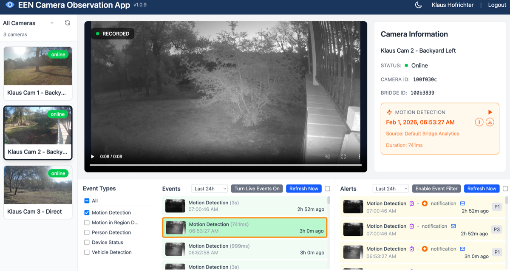

# EEN Camera Observation App

A Vue 3 single-page application for Eagle Eye Networks camera monitoring with live video streaming, event display, and real-time event push.



## Features

### Camera Management
- **Camera Sidebar** - Paginated list of cameras with live MJPEG preview thumbnails
- **Layout Support** - Filter cameras by predefined layouts or view all cameras
- **URL Camera Selection** - Deep-link to specific cameras via URL parameters (see below)

### Video Playback
- **Live HD Video** - Full-quality live streaming using the EEN Live Video SDK
- **Recorded Playback** - HLS video playback for historic events with precise timestamp seeking
- **Camera Information Panel** - Display camera status, name, ID, and account info
- **Event Playback Controls** - Click the event card to play/pause and seek to the event timestamp

### Video Export & Download
- **Download Button** - Export the currently playing video clip as an MP4 file
- **Export Progress Modal** - Real-time progress tracking during server-side export
- **Automatic Clipping** - Clips longer than 10 minutes are automatically truncated:
  - Calculates the midpoint between event start and end times
  - Creates a 10-minute window centered on that midpoint (5 min before, 5 min after)
  - Shifts the window if it extends outside the actual clip boundaries
  - Shows a warning banner when clipping occurs
- **Smart Filename** - Downloads use the format `<camera-id> - yyyy-mm-dd hh:mm:ss.mp4`
  - Timestamp reflects the actual start time of the exported video
  - Clipped videos include "clipped" suffix: `<camera-id> - yyyy-mm-dd hh:mm:ss clipped.mp4`
- **Clip Information** - Modal displays duration and file size upon completion

### Events System

The bottom section of the application contains three panels for event management:

#### Event Types Panel (Left)
- **Event Type Toggles** - Select which event types to display (motion detection, person detection, etc.)
- **Select All / None** - Quick toggle buttons to select or deselect all event types
- **Filter Scope** - Selected types filter the Events panel; optionally filter Alerts too

#### Events Panel (Center)
- **Event List** - Browse events matching selected event types with thumbnails
- **Time Range Selector** - Choose time window (10 min, 1 hour, 24 hours, 1 week)
- **Live Events Toggle** - Enable/disable real-time SSE event feed
  - Green "Disable Live Events" when active
  - Gray "Turn Live Events On" when inactive
- **Refresh Button** - Manual refresh with countdown timer when auto-refresh enabled
- **Auto-Refresh Checkbox** - Automatic refresh every minute
- **Event Thumbnails** - Hover to see enlarged preview with bounding boxes
- **Click-to-Playback** - Click any event to play recorded video at that timestamp
- **SSE Events** - Live events appear with blue background, turn green after refresh
- **Event Info Box** - Orange box in Camera Information shows:
  - Lightning bolt icon + event type name
  - Timestamp with play/pause controls
  - Event duration
  - (i) button to view full JSON data in modal

#### Alerts Panel (Right)
- **Alert List** - Browse alerts for the selected camera with thumbnails
- **Time Range Selector** - Independent time window selection
- **Event Filter Toggle** - Filter alerts by selected event types
  - Green "Disable Event Filter" when filtering active
  - Gray "Enable Event Filter" when showing all alerts
- **Refresh Button** - Manual refresh with countdown timer
- **Auto-Refresh Checkbox** - Automatic refresh every minute
- **Alert Thumbnails** - Based on alert timestamp, hover for preview
- **Notification Icon** - Envelope icon appears if alert has associated notification
  - Click to view notification JSON in modal
- **Priority Badges** - Color-coded priority (red >= 8, orange >= 5)
- **Click-to-Playback** - Click any alert to play recorded video at that timestamp
- **Alert Info Box** - Orange box in Camera Information shows:
  - Bell icon + alert type name
  - Timestamp with play/pause controls
  - (i) button to view full JSON data in modal

### JSON Data Display
- **Event Data Modal** - View complete event JSON with syntax highlighting
- **Alert Data Modal** - View complete alert JSON with syntax highlighting
- **Notification Data Modal** - View notification JSON for alerts with notifications
- **Copy to Clipboard** - One-click copy of JSON data
- **ESC to Close** - Press Escape or click outside to close modals

### Authentication
- **OAuth 2.0 Flow** - Secure login via Eagle Eye Networks OAuth
- **Session Persistence** - Stay logged in across page refreshes using localStorage
- **Token Auto-Refresh** - Automatic token renewal before expiration

### User Interface
- **Dark Mode Toggle** - Switch between light and dark themes with persistent preference
- **Event/Alert Highlighting** - Active event or alert shows orange border
- **Visual Camera Selection Feedback** - Selected camera shows thick border
- **Panel Tooltips** - Hover over panel titles to see descriptions
- **Bounding Box Overlays** - Object detection boxes shown on event thumbnails and video

## URL Parameters

The application supports deep-linking with URL parameters to restore camera selection, selected camera, event type filters, time range durations, auto-refresh settings, live events toggle, event filter, and dark mode.

### Full URL Format

```
http://127.0.0.1:3333/?id=<camera-ids>&selected=<camera-id>&events=<event-hashes>&ed=<duration>&ad=<duration>&er=1&ar=1&live=1&filter=1&dark=1
```

**Example:**
```
http://127.0.0.1:3333/?id=1005963a,100f030c,1003e46b&selected=100f030c&events=nkU,wOj&ed=24h&ad=1w&er=1&live=1&dark=1
```

### Parameters

| Parameter | Description | Example |
|-----------|-------------|---------|
| `id` | Comma-separated list of visible camera IDs | `id=1005963a,100f030c` |
| `selected` | Currently selected camera ID (must be in `id` list) | `selected=100f030c` |
| `events` | Comma-separated event type hashes | `events=nkU,6pF,wOj` |
| `ed` | Events panel time range duration | `ed=24h` |
| `ad` | Alerts panel time range duration | `ad=1w` |
| `er` | Events panel auto-refresh enabled (`1` = on) | `er=1` |
| `ar` | Alerts panel auto-refresh enabled (`1` = on) | `ar=1` |
| `live` | Live events SSE feed enabled (`1` = on) | `live=1` |
| `filter` | Event type filter for alerts enabled (`1` = on) | `filter=1` |
| `dark` | Dark mode (`1` = on, `0` = off) | `dark=1` |

### Camera Selection (`id` and `selected`)

- **`id` parameter** - Defines which cameras are visible in the sidebar
  - A **"URL-cameras"** option appears at the top of the layout dropdown
  - If a camera ID is invalid or inaccessible, an error card is shown
- **`selected` parameter** - Pre-selects a specific camera from the visible list
  - Must be one of the IDs in the `id` list (validated on load)
  - If omitted or invalid, the first camera is selected
- **Auto-sync** - The URL automatically updates when you change camera selection or visibility

### Event Type Filtering (`events`)

Event types are encoded as 3-character hashes to keep URLs short. The hashes use the DJB2 algorithm with base62 encoding.

**Common event type hashes:**

| Hash | Event Type |
|------|------------|
| nkU | Motion Detection |
| 6pF | Person Detection |
| X33 | Vehicle Detection |
| 55Y | Animal Detection |
| wOj | Device Status |

See [docs/event-type-hashes.md](docs/event-type-hashes.md) for the complete list of all 60 event types and their hashes, including the hash algorithm source code.

### Time Range Duration (`ed` and `ad`)

Controls the time range for the Events and Alerts panels. Valid values:

| Value | Duration |
|-------|----------|
| `10m` | Last 10 minutes |
| `1h` | Last 1 hour (default) |
| `24h` | Last 24 hours |
| `1w` | Last week |

Invalid values are ignored and the default (1h) is used. The duration is only included in the URL when not the default value.

### Auto-Refresh (`er` and `ar`)

Controls whether auto-refresh is enabled for the Events and Alerts panels:
- `er=1` - Enable events auto-refresh
- `ar=1` - Enable alerts auto-refresh

When enabled, the respective panel refreshes every minute. The parameter is only included in the URL when auto-refresh is enabled.

### Live Events Toggle (`live`)

Controls whether the live events SSE (Server-Sent Events) feed is enabled:
- `live=1` - Enable live events feed

When enabled, new events are pushed to the Events panel in real-time via SSE. The parameter is only included in the URL when the live feed is enabled.

### Event Filter for Alerts (`filter`)

Controls whether alerts are filtered by the selected event types:
- `filter=1` - Enable event type filter for alerts

When enabled, only alerts matching the selected event types are shown. The parameter is only included in the URL when the filter is enabled.

### Dark Mode (`dark`)

Controls the application theme:
- `dark=1` - Enable dark mode
- `dark=0` - Enable light mode (explicit)

When `dark=1` is in the URL, dark mode is enabled regardless of the user's previous preference. The parameter is only included in the URL when dark mode is enabled.

### URL Persistence

- All URL parameters persist through the OAuth login flow
- Parameters are stored in sessionStorage during authentication
- Sharing a URL allows others to see the exact same view (after login)

## Technology Stack

- **Framework:** Vue 3.5 with Composition API
- **Build Tool:** Vite 7
- **Language:** TypeScript
- **Styling:** Tailwind CSS v4
- **State Management:** Pinia
- **API Integration:** [een-api-toolkit](https://www.npmjs.com/package/een-api-toolkit)
- **Live Video:** @een/live-video-web-sdk
- **Recorded Video:** hls.js
- **Testing:** Playwright (E2E)

## een-api-toolkit Functions Used

This application uses the following functions from [een-api-toolkit](https://github.com/klaushofrichter/een-api-toolkit):

- **Authentication:** `initEenToolkit`, `useAuthStore`, `getAuthUrl`, `handleAuthCallback`, `revokeToken`
- **User:** `getCurrentUser`
- **Devices:** `getCameras`, `getLayouts`
- **Media:** `listFeeds`, `initMediaSession`, `listMedia`, `getRecordedImage`, `formatTimestamp`
- **Events:** `listEvents`, `listEventTypes`, `listEventFieldValues`, `createEventSubscription`, `connectToEventSubscription`, `deleteEventSubscription`
- **Alerts:** `listAlerts`
- **Notifications:** `listNotifications`
- **Jobs/Export:** `createJob`, `getJob`, `listFiles`, `downloadFile`

## Prerequisites

- Node.js 18+
- An Eagle Eye Networks account
- OAuth client credentials (client ID)
- An OAuth proxy URL (see [een-api-toolkit documentation](https://www.npmjs.com/package/een-api-toolkit) or [een-oauth-proxy](https://github.com/klaushofrichter/een-oauth-proxy) for an implementation)

## Setup

1. **Clone the repository**
   ```bash
   git clone https://github.com/klaushofrichter/een-observation-app.git
   cd een-observation-app
   ```

2. **Install dependencies**
   ```bash
   npm install
   ```

3. **Configure environment variables**

   Create a `.env` file in the project root:
   ```
   VITE_PROXY_URL=https://your-oauth-proxy.workers.dev
   VITE_EEN_CLIENT_ID=YOUR-CLIENT-ID
   TEST_USER=your-test-email@example.com
   TEST_PASSWORD=your-test-password
   ```

4. **Start the development server**
   ```bash
   npm run dev
   ```

   The app will be available at `http://127.0.0.1:3333`

## Scripts

| Command | Description |
|---------|-------------|
| `npm run dev` | Start development server |
| `npm run build` | Build for production |
| `npm run preview` | Preview production build |
| `npm test` | Run Playwright E2E tests |

## Project Structure

```
src/
├── components/
│   ├── CameraSidebar.vue      # Paginated camera list with layout filter
│   ├── CameraCard.vue         # Preview video card with status badge
│   ├── ErrorCameraCard.vue    # Error card for inaccessible cameras
│   ├── MainVideoPlayer.vue    # HD video with Live SDK + HLS playback
│   ├── EventTypesPanel.vue    # Event type toggles
│   ├── EventsPanel.vue         # Events panel with thumbnails (historic + live)
│   ├── AlertsPanel.vue        # Alerts panel with SSE live feed
│   └── ExportStatusModal.vue  # Video export progress modal
├── composables/
│   ├── useImageCache.ts       # LRU cache for event thumbnails
│   ├── useHlsPlayer.ts        # HLS.js player management
│   ├── useEventAge.ts         # Event age formatting
│   └── useVideoExport.ts      # Video export with auto-clipping
├── views/
│   ├── Home.vue               # Main application view
│   ├── Login.vue              # OAuth login page
│   ├── Callback.vue           # OAuth callback handler
│   └── Logout.vue             # Logout page
├── router/
│   └── index.ts               # Vue Router with auth guards
├── assets/
│   └── main.css               # Tailwind CSS styles
├── App.vue                    # Root component with auth initialization
└── main.ts                    # Application entry point

tests/
├── auth.spec.ts               # Authentication tests
├── cameras.spec.ts            # Camera selection tests
└── events.spec.ts             # Events system tests
```

## Testing

The project includes Playwright E2E tests covering:

- OAuth login/logout flow
- Camera sidebar and selection
- Video player switching
- Event type toggles
- Events and alerts panels

Run tests:
```bash
npm test
```

Run tests with UI:
```bash
npx playwright test --ui
```

## Configuration Notes

### OAuth Redirect URI

The app must run on `http://127.0.0.1:3333` to match the OAuth redirect URI configuration. The Vite config enforces this:

```typescript
server: {
  host: '127.0.0.1',
  port: 3333,
  strictPort: true
}
```

### Router Guard Order

The OAuth callback check must come BEFORE the auth check in the router guard. The EEN IDP redirects to the root path (`/`) with `code` and `state` query parameters.

## Claude Code Agents

This project includes specialized Claude Code agents for een-api-toolkit development:

- `een-setup-agent` - Vue 3 project setup and configuration
- `een-auth-agent` - OAuth authentication flows
- `een-devices-agent` - Camera and bridge management
- `een-media-agent` - Video streaming and playback
- `een-events-agent` - Events and SSE subscriptions
- `een-grouping-agent` - Layouts and camera groupings
- `een-users-agent` - User management

## License

MIT
